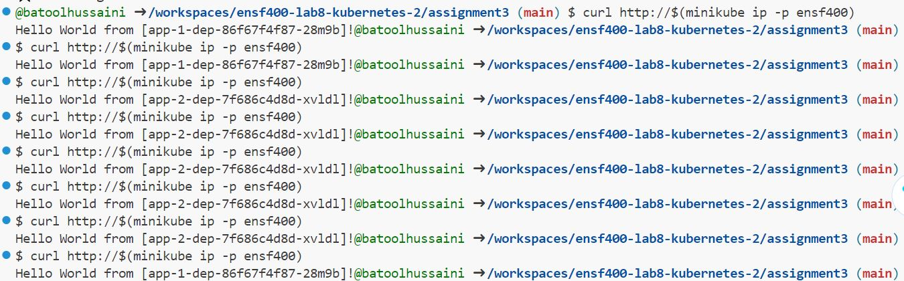
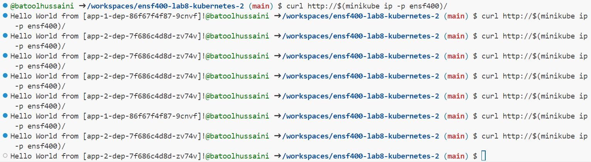

# Steps Taken For Assignment 3
#### Batool Hussaini Syeda (UCID: 30140724)
1. If you are already not, cd into the assignment3 directory:
```cd assignment3```

2. Start Minikube with profile name from Lab 8 Instructions: 

    ``minikube start -p ensf400``

Minikube manages Kubernetes clusters locally if you wish to restart and delete the minikube for whatever reason you may use the command:
    ``minikube delete -p ensf400``

3. Apply all Kubernetes configuration files (Deployments, Services and Ingresses). Applying these files create specified resources in the Kubernetes cluster: ```kubectl apply -f .```

4. Enable the Ingress addon in the cluster with the ensf400 profile name:

    ```minikube addons enable ingress -p ensf400```

5. Test the accessibility of the cluster:

    ```http://$(minikube ip -p ensf400)```

# Output 

 and 


# Notes on how Output matches Requirments:

Nginx Deployment:
- nginx-dep.yaml defines Deployment (nginx-dep) with 5 replicas, using the nginx base image with version 1.14.2.
- default.conf config file mounted to path (/etc/nginx/conf.d) in the nginx Pods (serving as a load balancer)

ConfigMap:
- nginx-configmap.yaml defines ConfigMap (nginx-configmap) with the required upstream server configuration for app-1 and app-2.

Service:
- nginx-svc.yaml defines a ClusterIP Service (nginx-svc) that exposes port 80 and selects the pods from the nginx-dep Deployment.

Ingress:
- nginx-ingress.yaml defines nginx-ingress (Ingress) that redirects requests to path / to the backend service nginx-svc.

*The curl commands demonstrate successful responses from both app-1 and app-2 deployments, indicating that the Ingress configuration is functioning properly and load-balancing traffic between them.*

App-1 and App-2 Deployments:
- Mention of app-1 and app-2 deployments and provided outputs demonstrate successful responses from both, indicating correct implementation and deployment.

App-1 and App-2 Ingress:
- Successful responses from both app-1 and app-2 imply proper functioning of the Ingress configurations for these apps.

